# Create a Teams App for the Application Portal

Creating a Teams app for the application portal requires the following steps:

1. Allow Liquit to be used in Teams.
2. Create an app in the developer portal.
3. Publish the app to the organization.
4. Allow the app for users in the organization.

## Allow Liquit to be used in Teams

In the security settings for the application portal, the embedded use of the web page and authentication from apps is blocked by default. To be used in Teams, this must be allowed by specifying the Teams URL as an exception. To do this, open the Liquit portal and login with an admin account, allowed to change security settings.  

In the management portal, go to Security Settings. In the *Content Security Policy* add *teams.microsoft.com* to the list of websites that is allowed to embed the zone:
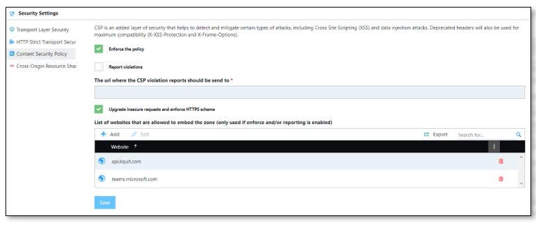  
In the *Cross-Origin Resource Sharing* add *teams.microsoft.com* to the list of websites that is allowed to authenticate against the zone:
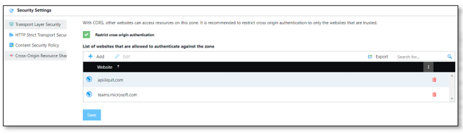

Click *Save*

## Create the app

Browse to the [Developer Portal]( https://dev.teams.microsoft.com/apps) and login with an admin account.

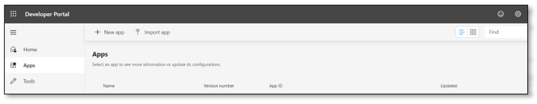

Click *New app*.
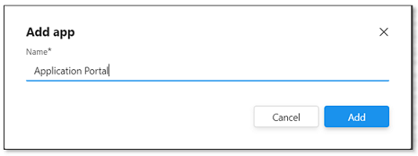{: .center}
Give the app a name, ‘Application portal’ and click *Add*.
The app configuration wizard shows up in the Developer portal.

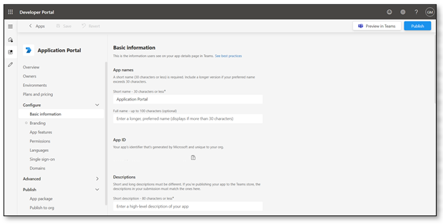

Specify the following properties:

### Basic information

|Property|Value|
|-------|-----|
|Short Name|Application Portal|
|Full Name|Application Portal|
|Description|Sogeti Smart Workspace Application Portal|
|Long description|Access your apps from a single pane of glass|
|Developer or company name|Sogeti Nederland BV|
|Website (must be a valid HTTPS URL)|"https://www.sogeti.nl"|
|Privacy policy|"https://www.sogeti.nl"|
|Terms of use|"https://www.sogeti.nl"|

### Branding

Provide custom icons

### App features

Add a personal app by clicking on the Personal App button.
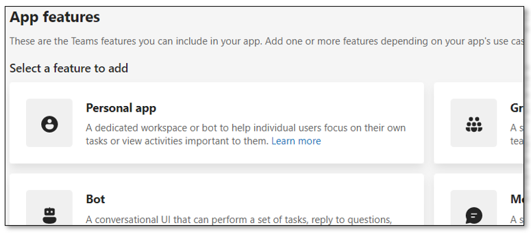

Click on the button to add a tab in the personal app:  
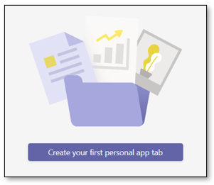{: .center}

Provide the proper values in the following screen.  
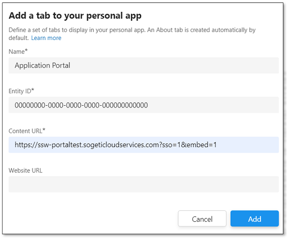{: .center}

- The entity ID is a generated guid - accept the given value.
- The website URL is optional, if you use the same URL as the Content URL, the user can open the application portal in a separate web page in the browser.

Click *Add* when you are satisfied.

### Language

Optionally, you can add different values for the app for other languages, such as Dutch.
In Languages, click *Add a Language*, the following screen appears:
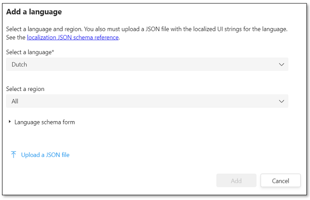{: .center}
Select a language and region, then click *Language schema form*. Fill in the values as the following example:
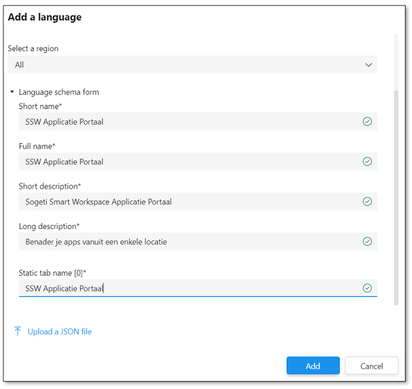{: .center}
Click *Add*. When users change their language to Dutch in Teams, above values will be used.
Add more languages if the customer is multi-national. You could also change the default language.

## Publish the app

The app is now ready to publish. In the *Publish* menu item, click *Publish to org*, select *Publish your app*.  
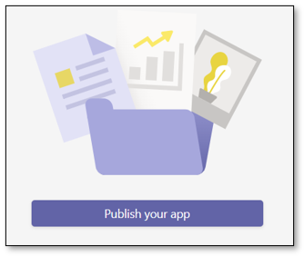{: .center}  
The app should show up with status *Submitted**  
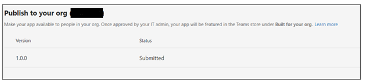  

An admin now must approve the new app. To do this, browse to the [Teams Admin Center](https://admin.teams.microsoft.com) and login with a Teams Admin account.  
In the Teams admin center, go to *Teams Apps* and then *Manage Apps*. You should see one app pending for approval.  
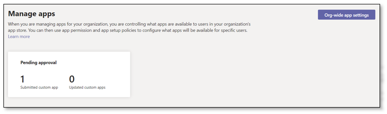  
Search for your app, it has publishing status *Submitted* and is *Blocked*.  
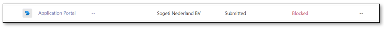  
Click on the app.
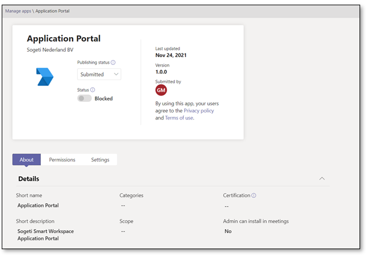  
Review the app configuration. When you are satisfied, select *Publish* under *Publishing status*. In the confirmation windows, select *Publish*.
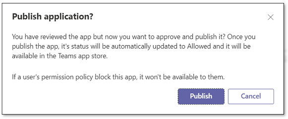  
The app may now be published to all users, depending on the permission policies in Teams.
To test, make sure the app is only visible to you and allow the app for all users once tested.

## App Permissions

In the Global (org-wide default) policy you may want to change the custom apps to be blocked if the org doesn’t use any custom apps yet, or just allow the ones that the org uses in case they do.  
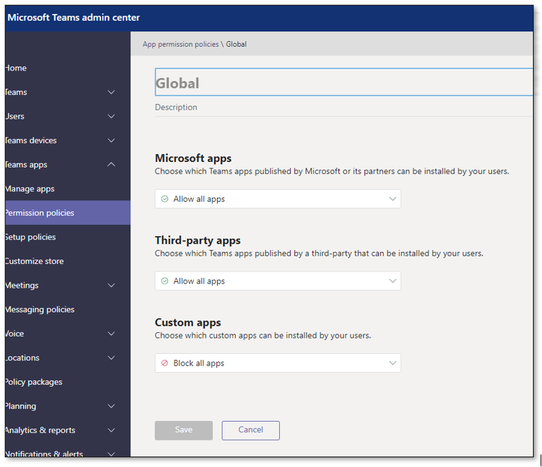  
Add a new policy that allows only the created teams app as a custom app by selecting Add apps:  
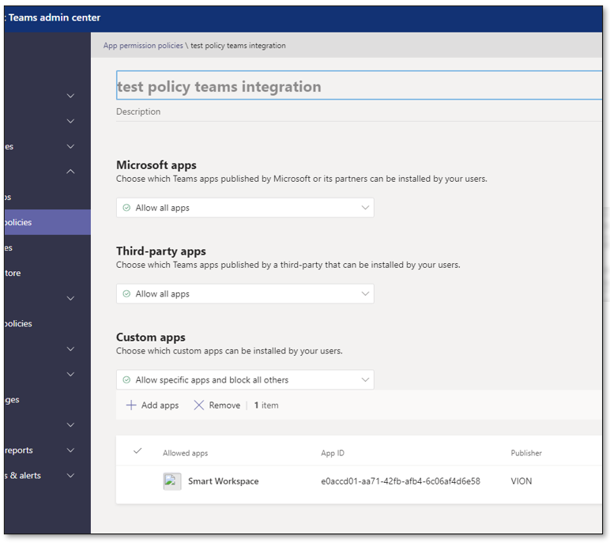  
Add test users to the custom created policy by clicking Manage users:  
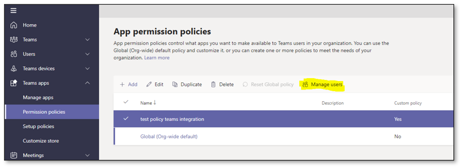  
This way the app could/should be deployed only to the specified users.
