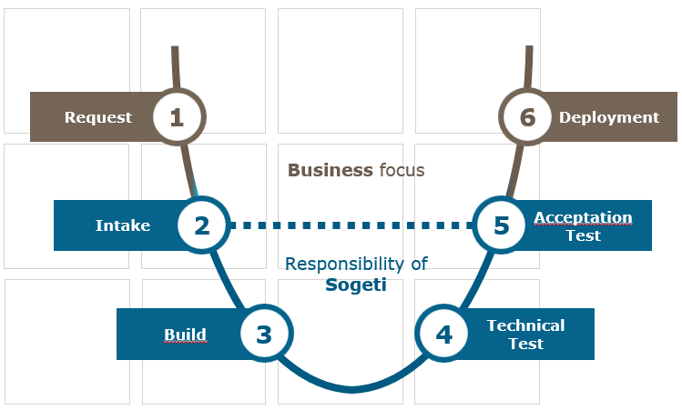

# Sogeti Smart Workspace packaging process

This chapter describes the standard process used for packaging applications that are deployed in SSW. Different types of packages are being used, such as MSIX, MSI or unattended installations. The process for each is similar, using the following phases:

## Request

In the onboarding phase, a request is processed by adding the application to the list of required applications, combined with the proper priority. After onboarding, in the Run phase, new requests for packages are initiated by a change request in Service Now. Requests for business  applications are always initiated by the customers. Requests for applications that are part of the SSW solution, such as agents, are initiated by the Sogeti run team.

## Intake

An application expert (functional- or technical application manager, key- or senior user), together with the (Sogeti-)intake engineer, install and configure the application on a reference computer. All application properties, characteristics and dependencies, and the activities carried out during installation and configuration of the application are documented in the *Intake Document*. The intake is finalized with both a technical and a functional application test, which are also described in the intake document. The application source media and the intake document form the *Application Dossier* which is handed over to the next step in the process.

### The customer is responsible for delivering

* the source media and, when applicable, test cases, documents and files
* documentation, used as input for the intake
* test and acceptance of the application and intake document

### Sogeti is responsible for

* configuring and preparation of the intake computer
* installation and configuration of the application, instructed by the application expert
* documenting all information provided during the intake
* collecting the source media

### The following items are included in the intake document

* Meta data (such as name, version, application expert contact information)
* Application type and proposed target platform (web/SaaS, local, remote)
* Dependencies (other software, hardware, network- or other infrastructure components)
* Update strategy in the application lifecycle (auto-update, new package request)
* Installation steps
* Configuration steps
* Technical and functional test

## Build

Using the intake document and the packaging guidelines, a Sogeti package engineer constructs and builds a package. The engineer tests the installation and deployment of the package, followed by a technical test. This test is based on standard tests and optionally, additional tests described in the intake document. The output of the build step is:

* package project files
* compiled package and/or deployment script
* package release document

The package release document describes the way how the package is constructed, special actions taken during packaging and deviations from standards (if any). The package also describes the application test and if there were issues, considered as known issues (for example caused by the environment in which the package is build and tested). Finally, the release document contains information used to configure the application in the deployment environment and/or application portal (installation command, detection rules, user specific configuration, etc.)

## Technical test and QA

A second package engineer, other than the engineer that build the package, checks and tests the package. This Quality Assurance (QA) step is added to the process to make sure packages are build according to the packaging guidelines and intake document and is ready to offer to the client for acceptance. QA is under responsibility of Sogeti and the results are documented in the package release document.

## Acceptance test

A Sogeti engineer configures the package in the deployment environment (Intune and/or the Application Portal) and tests the deployment:

* proper installation
* when applicable, the upgrade of a previous version
* successful launch in the application portal
* technical test
* proper un-installation / removal

This test is carried out on a test device in the production environment.
Only after the application is successfully tested, the application is offered to a customer test user. Typically, this test user is appointed by the customer and can also be the (functional or technical) application manager, senior- or key-user. The test user confirms the application installs and works successfully, according to what has been documented during intake. The acceptance test can result in one of the following outcomes:

* The package installs and works according to the requirements, as documented in the intake and is accepted. The next step is to *Deploy* the package.
* The package does not install or work as expected by the tester but works according the specifications in the intake document. Before acceptance, a new intake must be carried out. The next step is *Intake* where the intake document is changed, the process is continued from there.
* The package does not install or work according to the specifications in the intake document. Before acceptance, a new package must be build based on the existing intake document. The next step is *Build* where the package is corrected or a new package is created, the process is continued from there.

During acceptance:

* Sogeti is responsible for a first (technical) deployment and application test.
* The customer is responsible to assign a test user, test and accept the package.
* Sogeti is responsible for assigning the application to the proper test user.

## Deployment

The package is accepted and is now ready for deployment to end users or end user devices:

* Generic applications – applicable for all devices or end-users - will be offered to all users/devices. Optionally, deployment can be staged, using different groups in the deployment (such as pilot, test, production). Sogeti engineers monitor deployment success and take actions for remediation in case of issues.
* Specific applications – used by a limited group of users – will be targeted to an Azure Active Directory group. This group is provided and managed by the customer (add/remove users). Sogeti engineers monitor deployment success and take actions for remediation in case of issues. Optionally, deployment can be staged by adding sets of users to the target group during deployment phase.

When an issue with the package is found after deployment, a new intake will be planned (package is build according the intake document) or a fix is created (package not build according intake). During run, package rework after initial deployment will be handled through the change process, starting with intake or build, depending the root cause.
