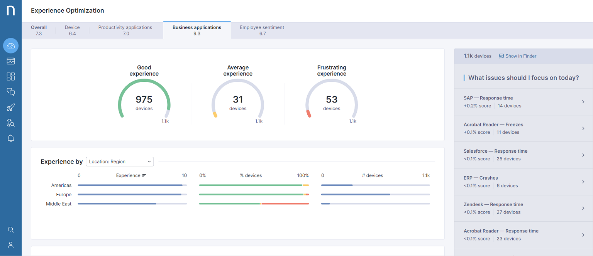
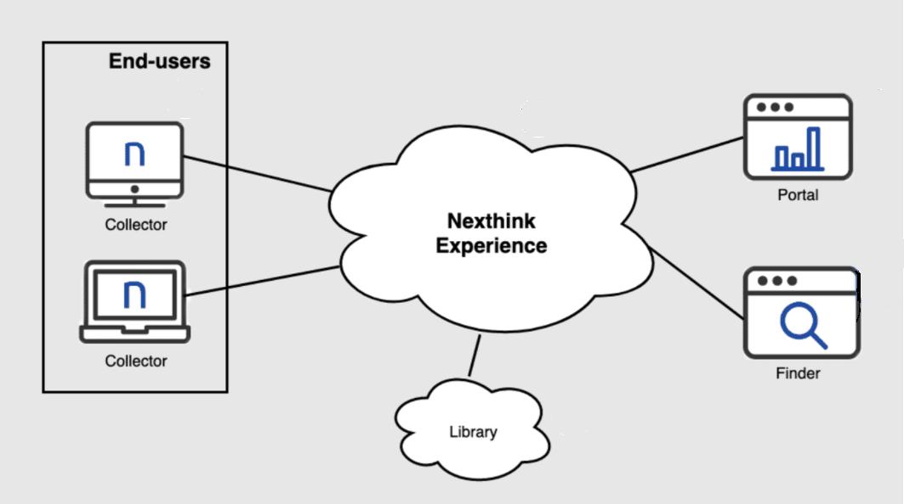

# Introduction User Experience Monitoring

Off course we want to give our customers and their users the best experience we can offer. To make sure user experience is at (or above) expected level and to monitor experience over time, we use the module **User Experience Monitoring**.  
A collector is installed on Windows devices, which inventories device- and installed application-properties and also collects errors, warnings and measures performance at user, device, application and network (connectivity) level. Collected data provides us with insight in the *measured* experience and shows us where we need to improve, where (structural) issues are and where we need to take action. For some issues, remediation tasks can be initiated from the central management console to repair issues on end-user devices. Additionally, periodic surveys ('Campaigns') can provide us and the customer with feedback from end-users.

## Architecture

The following figure shows the architecture for Nexthink in a cloud setup.

