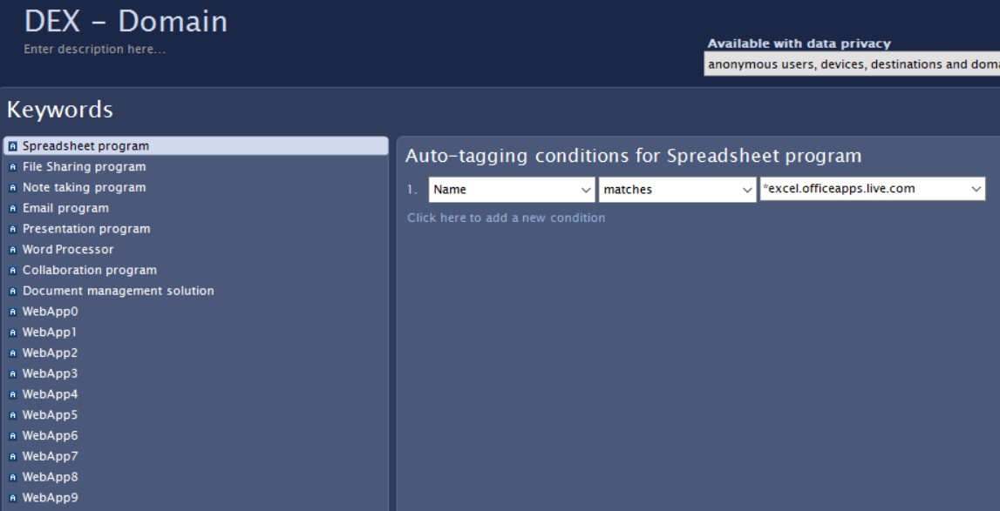
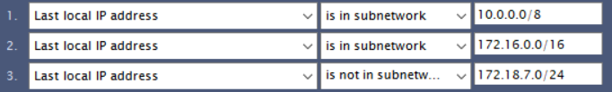
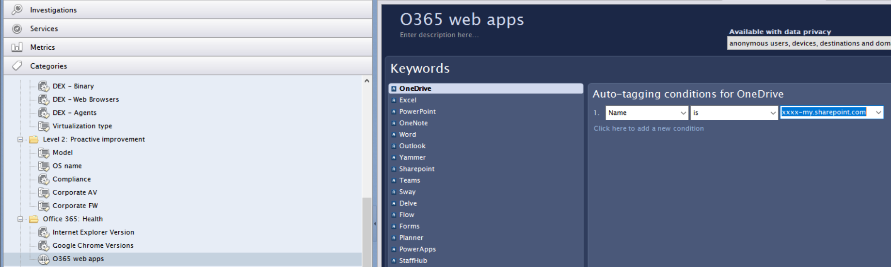
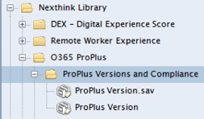
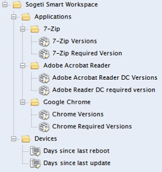
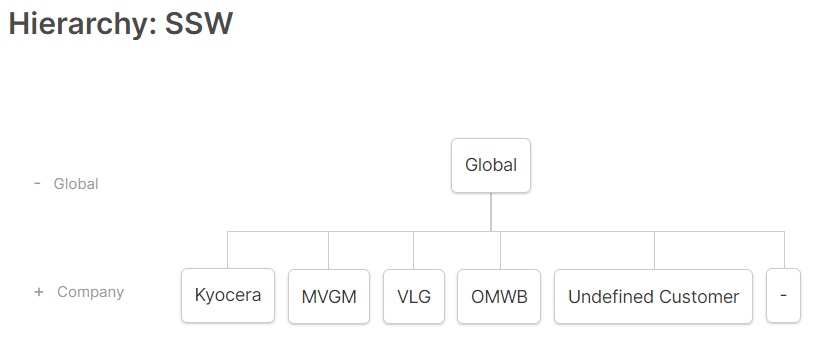

# Onboard End User Experience Monitoring

Onboarding a customer in Nexthink End User Experience Monitoring requires a number of steps, beginning with the request for a customer tenant. The tenant is created by Nexthink upon request, initiated by the engagement / delivery manager. Once the tenant is made ready for us, onboarding can start, following the standard onboarding process steps. Note that we can use a shared tenant for small customers. This is described at the end of this chapter.


## Intake

During intake, the use of Nexthink as a solution for End-user Experience Monitoring is explained to the customer. The following important information is gathered during intake:

* The use of anonymization in the product, to remove privacy related information such as user names and domain names. The default is *not* to use anonymization in the collector.
* A list of business critical or important applications that will be included in the Business Application Experience scores (up to 8 desktop apps and 10 web apps can be included).
* Global insight in the business organization, such as different countries and locations, to gain insight in location based experience later on. When applicable, this also includes an IP-plan on which location of the device can be determined.

## Build

Since Nexthink is a SaaS application, we speak of configuration rather than build, but to keep inline with other onboarding activities this step is named build.  
During this step, the initial configuration for Nexthink is done, following the procedures described in this paragraph.  

### Initialization

The build starts when the following items are arranged or available:

* A new tenant is created, and (initial) licenses are assigned.
* The ‘welcome email’ is sent with information regarding the tenant:
    1. Customer specific URL / host name.
    2. Admin password.
    3. Customer key file for use in the collector.

#### First time activities

The following steps are the first to take when above information is received:

* Store the customer key file in TeamPass.
* Login to the Nexthink portal with the admin account
* For safety, create a second account to circumvent lockout.
* Change the admin password and store the new password in TeamPass.
* If not already installed, install the Finder application from the portal on your device where you do your administration tasks.

#### Collector Package creation and deployment

Configuration of Nexthink is easier if some data is already collected and present. Therefore, creating a deployment package for the Nexthink Collector is done before continuing. The package is deployed with an Intune win32 app, that is created using the following procedure:

* Download the sources to create a package for the collector (the URL is specified in the welcome email).
* Create a collector package with the following parameters, this will output a silent installer executable and a silent executable for un-install:

```text
Engine Address (DRV_IP): <customer>-engine.eu.nexthink.cloud
Engine Port (DRV_PORT): 999
Coordinator Port (CRD_PORT): 443
DNS options: Prefer IPv6 (DRV_PREFERIPV6): FALSE
Collector Tag (DRV_TAG): 
Collector String Tag (DRV_STRING_TAG): 
Install Control Panel extension (CPL_INSTALL): FALSE
Install Browser Extension (INSTALL_BROWSER_EXTENSION): FALSE
Install Configuration Tool (CFG_INSTALL): TRUE
Hide from Add/Remove Programs (ARPSYSTEMCOMPONENT): FALSE
Script execution policy: signed_trusted_or_nexthink
Enable Web and Cloud Data (DRV_WEB_AND_CLOUD_DATA): TRUE
Report print jobs and printers (PRINTING): FALSE
Use the assignment service (USE_ASSIGNMENT): TRUE
Data over TCP (DATA_OVER_TCP): TRUE
Engage (ENGAGE): enable_except_on_server_os
Error Logs directory:
```

* Create a distribution package for Intune, using the PowerShell App Deployment Toolkit and wrap it as an intunewin file.
* For installation, use an Intune win 32 App package with the following settings:
    1. Install command: Deploy-Application.exe
    2. Uninstall command: Deploy-Application.exe -DeploymentType 'Uninstall'
    3. Install behavior: System
    4. Detection rule: File C:\Program Files\Nexthink\Collector\Collector\nxtsvc.exe exists
    5. Target to device group as a required app

Note: Make sure the default Deployment Type is set to *Install* and Deploy Mode is set to *Silent* in the ‘PSAppDeployToolkit’ script.

Deploy the package to a test device and check the following:

* The package reports successful installation in Intune.
* The collector reports to the Nexthink engine and the device shows up in the Finder application

### Installation of Library packs

Library packs can be installed from the [Nexthink online library](https://www.nexthink.com/library){target=_blank}, search the library in Finder or import from a local file in Finder.

#### Import Nexthink online library packs

Open the Finder app and login with an administrator account for the tenant you are about to configure. Install the following Nexthink library packs using the Nexthink Online library:

* Digital Employee Score (DEX Score). Follow the procedure described [here](https://www.nexthink.com/library/digital-experience-score){target=_blank}. Also take a look at this document: [Dex Score Configuration](https://doc.nexthink.com/Documentation/Nexthink/latest/LibraryPacksConfiguration/DEXScoreinstallationandconfiguration){target=_blank}.

* Remote Worker Experience. Follow the procedure as described [here](https://doc.nexthink.com/Documentation/Nexthink/latest/LibraryPacksConfiguration/RemoteWorkerExperienceManagement){target=_blank}. After installation, install the update for [V2](https://doc.nexthink.com/Documentation/Nexthink/latest/LibraryPacksConfiguration/DEXV2UpgradeofRemoteWorker){target=_blank}. Replace all items that already exist (a message is shown where you can choose skip or replace). The metrics Web Browsing Score and Security Score metrics for Remote and Office Workers should be removed, as described in the web page.

* Level 1 Checklist. Follow the instructions as described [here](https://www.nexthink.com/library/level-1-checklist/?searchReturn=level%201%20support){target=_blank}.

* Level 2: Proactive improvement. Follow the instructions as described [here](https://www.nexthink.com/library/level-2-proactive-improvement/?searchReturn=Level%202%3A%20Proactive%20improvement){target=_blank}.

* Office 365 Health. Follow the procedure as described [here](https://www.nexthink.com/library/office-365-health/?searchReturn=office%20365%20health){target=_blank}.

#### Import the Sogeti Smart Workspace Library Pack

Download the Sogeti Smart Workspace Library pack [here](/assets/resource/SSWLibraryPack-v2.0.0.xml). In Finder, click on the cogwheel in the top of the Finder window and select Import Library Pack from file. Browse to the downloaded xml file for the SSW Library pack and import the file. Upon import, leave any metrics or categories already present unchanged (choose Skip).

#### Publish dashboards

Upon import of the library packs, several dashboards are created in the portal. By default, these will be created in the *Personal Dashboards* area and are not visible for other users and admins. Go to each dashboard and publish the module. Optionally, you can leave the dashboard in the personal dashboards for later use if you want to make modifications. When you do, you need to re-publish modified dashboards, overwriting versions published earlier.

### Library pack configuration

In order to measure the proper resources, the library packs need configuration in the Finder app to match the organization specific setup.

#### Update the DEX – Digital Experience Score Categories

In Finder, go to Categories, Nexthink Library, DEX – Digital Experience Score:


Click on *DEX - Domain* in the categories.



* In DEX – Domain, update any references to the Office 365 Tenant in File Sharing Program and Document Management Solution. Replace YOURTENANT by the customer’s tenant.
* In DEX – Domain, specify relevant domains in each of the Web Apps (0-9)
* Press Save and then Cancel. In the list of domains, you should see references to the programs for the customer’s Office 365 domains.

Click on *DEX - Binary* in the categories.


In the binaries, applications of interest can be monitored. A list of Office 365 apps already is configured. Go through them to see if this matches the customer’s environment.
Configure relevant applications in Document Management solution and DesktopApp 0-7.

Click on *DEX - Web Browsers* in the categories.
Check this section for all web browsers available.

Click on *DEX - Agents* in the categories.
Check this section for agent configuration.

#### Update Remote Worker Experience

Update Remote Worker vs Office Worker Device.
This section determines if the user is seen as using a remote or an office-based device. This determination is done using the (local) IP address. The default is set as below and might need to be changed to reflect the customer:



##### Office workers

Remote workers are defined whenever the device internal IP address is not in one of the ranges above.

##### Firewall / AV / Other Packages

Fill in the used Firewall / AV product

##### Firewall / AV / Other Executables

Fill in the used Firewall / AV product

##### VPN Executables

Fill in the executable for the VPN product.

#### Update Level 2: Proactive improvement

##### Corporate AV and Corporate FW

Fill in the proper applications/names for the used AV and FW products.

#### Update Office 365 : Health

##### O365 Web Apps

Make sure the current tenant info us filled in, replace YOURTENANT by the customer’s tenant.



#### Update O365 ProPlus

##### ProPlus Version and ProPlus Required Version

Fill in the various ProPlus Versions and Required Version for the Office 365 package. You can also import [this](/assets/resource/O365 ProPlus Categories.xml) xml file, containing an up-to-date the history of Office 365 packages. Goto the folder *ProPlus Versions and Compliance* in Nexthink:



Right-click on the folder, select Categories from files and select the xml file you just downloaded. Check and update the ProPlus Versions and Required Version to match your environment.

#### Update Sogeti Smart Workspace library

The Sogeti Smart Workspace libary pack contains monitoring on versions of the default applications that come with the solution:

* 7-Zip
* Google Chrome
* Office 365 ProPlus
* Adobe Acrobat Reader DC

For each of the applications, the current version must be configured in the categories:



Right-click on the *Required Version* category for each application and select *Edit*. Update the version for *Current* to match your environment and click *Save*.

### Add a new customer to the shared environment

For small customers, we use a shared environment as specific environments is only applicable for customers > 1300 users. This environment already is up and running and configured so all we need to do is to introduce the new customer.

It is important that the collected data and dashboards for the different customers are separated from each other:

* Create per customer dashboards to report per customer experience and establish per customer analysis.
* Make sure customers only have access to their own data.
This is achieved by using a customer specific collector tag, that is specified in the collector package (see paragraph 1.3 Collector Package creation and deployment). Currently, we have the following customers in this environment:

|Customer|Collector Tag|
|--------|-------------|
|Kyocera|1|
|MVGM|2|
|VLG|3|
|OMWB|4|

#### Hierarchy

Using the tag, we can separate data from the different customers. In Nexthink this is achieved using the hierarchy. The hierarchy in Nexthink is an organizational diagram for all collector clients in the tenant, build up with the structure:

* Global (all collector agents)
* Company (MVGM, Kyocera, VLG, OMWB)
* Country (optional country if the organization operates in more than one country)
* Entity (the location within the country)
Each collector client belongs (is attached to) a single entity.

Similar to the following figure:
{: .center}

For instance, the customer VLG, we only have the Netherlands as country:
{: .center}

And for the location, we only specify one office and home (meaning ‘outside the office’).
If we have more countries, we can add these to the hierarchy as we like. This is the case for Kyocera and MVGM.

The hierarchy is configured in Nexthink using a csv file that is uploaded in the engine. The csv file has the following format:
First line in the csv: specifies the structure of the hierarchy used in the csv. The value is as follows, where ‘SSW’ specifies the name of the hierarcy:  
`"SSW";"source.ro:Entity";"false";"false"`

Second line specifies the attributes used, the value for this line is:
`"Company";"Country";"Entity"`

The other lines (from line 3 onwards) specify the entities in the hierarchy. For each entity the company, country and entity are specified. For example:  
`"Kyocera";"Austria";"Kyocera - Austria - Wolkersdorf"`  
`"Kyocera";"Belgium";"Kyocera - Belgium - Sint-Pieters-Leeuw"`

#### Collector rules

When the hierarchy is defined, rules need to be specified that assign the proper entity to the different collector instances. The assignment rules use the collector tag, (optional) collector string tag and client IP address. When the collector connects to the Nexthink engine, the rules are evaluated, and an entity is assigned to the collector. By default, the following rules are applicable for all customers:

* Collector Tag, to specify the customer organization
* Client IP address, to specify the entity. By default, we use the entities ‘Office’ and ‘Home’, to separate collectors for devices used within the corporate network and devices outside the company network. When different entities (locations) within the organization exist using a unique range of IP addresses, the range is used to specify the entity.
* As an alternative for using the client IP address for entity assignment, the collector string tag can be used. The collector string tag needs to be defined in the collector, either by specifying this during installation or after installation, using the Nexthink configurator tool (installed with the package). Note that unique packages need to be created when the collector string tag is to be set during installation.

Similar to the hierarchy, rules are specified in a csv file which is uploaded to the Nexthink portal. Different rulesets can be configured of which only one can be active. The csv file is build up with the following lines:

The first line contains the header, by default has the following value:  
`"Entity_rule";"Engine";"Entity";"Field1";"Pattern1";"Field2";"Pattern2"`

The following lines contain the rules, one line for each rule. The order of rules (top to bottom) specify which rule is applied in cases where multiple rules may apply to a collector.

The minimum content in the rules file is:
  
```text
"Entity_rule";"Engine";"Entity";"Field1";"Pattern1";"Field2";"Pattern2"
"No";"engine-1";"Customer - Home";"collector_tag";"x";"local_ip";"192.168.0.0/16"
"No";"engine-1";"Customer - Office";"collector_tag";"x";"name";"*"
"No";"engine-1";"Undefined Customer";"collector_tag";"0";"";""
"No";"engine-1";"Undefined Entity";"name";"*";"";""
```

(*x* is the customer specific collector tag and we only use a single Nexthink engine, “engine-1”).

In this case, the rules are evaluated as follows:

* Collectors with collector tag x will be evaluated to Customer - Home or Customer – Office
* If the client ip address is in the range 192.168.0.0/16, Customer – Home is assigned, if not, Customer – Office is assigned.
* Collectors with collector tag ‘0’ always will be assigned with Undefined Customer
* Collectors with a collector tag not specified in one of the rules will have Undefined Entity as assigned entity.

When a new ruleset is uploaded to the engine, the ruleset can be validated using the simulation function. When simulation has the desired results, the new ruleset can be set to active. The existing, active ruleset will be de-activated automatically.
