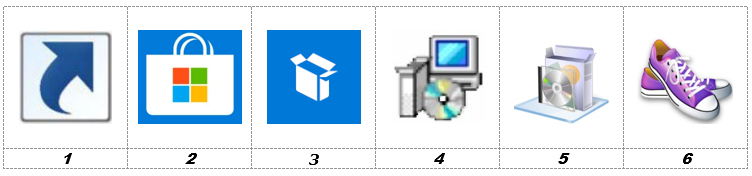

# Application Guidelines

Application guidelines must be known in order to create intakes and build packages in a standard, repeatable way that fits in the modern, managed workspace environment. This chapter describes the application guidelines to be used in the SSW packaging process.

## Application types and order

Application packages generally exist in the following types:

1. Shortcut or URL
2. Applications from the Microsoft Store for Business
3. Applications that are repacked to the MSIX format
4. Unattended or silent installation, including MSI packages when the source media already is an MSI package
5. Applications that are repacked to the MSI format
6. Manual installation

The preferred packaging method / application type starts with a type 1. If type 1 is not an option, then the package will be a type 2 and so on. The last possibility is a type 6. For SSW, type 1 and 2 can be managed from Intune and the application portal and do not need (re-)packaging. Default assumption (when no information is present) is that the application will be a type 3 if packages types 1 or 2 are not possible or applicable. In all cases, packages of type 6 should be avoided.

The packager tries to build the package according to the prescribed application type in the intake document. If issues arise, the packager will contact and advice the SSW package lead for a type change.

The following table can be used as a guide to determine/predict the application’s preferred packaging method:

|Type|Used for, or when|
|:--:|----------------|
|1|URL to web or SaaS apps, shortcuts to OS system installed local apps and shortcuts to network applications that can run with user credentials, without additional software requirements (not included in the base installation)|
|2|Applications from the Microsoft Store for Business that can be configured directly in Intune for deployment or enabled in the Store for Business|
|3|MSIX -  1st alternative when type 1 or 2 is not applicable |
|4|Unattended install - 2nd alternative when the application cannot be packaged to an MSIX package or does not work as an MSIX package|
|5|Repackaged MSI - 3rd alternative when the application installation, as delivered by the vendor, cannot be run silently
|6|Manual - 4th alternative when the installation cannot be repackaged and there is no way to install the vendor’s media silently. For example, hardware depending activation or configuration.|

## Common rules

The following general rules apply for the SSW workspace:

* Applications of type 1 and 2 follow a light intake and do not need packaging. Applications of these types can be configured directly in Intune and/or the application portal.
* Default for all other applications will be a type 3.
* It must be possible to install and run the application correctly on the target OS environment. If possible, applications that adhere to the Windows Logo Guidelines (Windows 10 compliant) will be selected instead of legacy applications.
* The intake document describes all the features to be installed for packages.
* It is good practice not to use the options Complete or Typical installation but always to select a Custom installation. Using a Custom installation, it is clear which features exactly must be installed and which are not to be installed.
* Some (MSI-) installations by default offer features to be installed on first use. The use of this option is prohibited, either select the feature to be installed locally or absent.

## Intake with multiple setups

When an application consists of multiple setups that are considered to be prerequisites, these prerequisites must be defined as separate applications. Mostly these prerequisites are some kind of middleware. For those applications, separate intakes (and corresponding packages) will be created. Examples of this kind are:

* dotNet Framework (when not part of the OS)
* SQL, Oracle, or other database clients
* Java Runtime Environment (JRE)
* Sentinel or Dongle drivers
* Etc.

When an application consists of multiple setups from the same vendor, then the total is considered to be one single application and thus package. This package however, can contain different installation files (setup.exe's or MSI packages).

A different approach can be taken for MSIX- or repackaged MSI packages. When the middleware is exclusive for the specific application, this middleware application can be included in the package. Both the application and the middleware will be packaged as a single application suite.

* When the application is generic and used by other applications, it is better to build a separate package. This package can be built as an independent deployable MSI package or unattended setup. This may not be the case for MSIX packages, when this approach does not work. The dependent application may be included in the MSIX package.
* When the application is unique for the application, a single package is built. For MSI packages, all applications are included in a single capture. An exception can be made when components already are delivered as MSI package. In this last case, an MST file is preferred for each package and an installation script is created to install the combination of packages.

Splitting applications will be done based on mutual agreement between the packager and SSW package lead. Good insight in the complete application portfolio is necessary to make the desired decisions.

## Installation folder

By default applications are will be installed in the Program Files folder; “%ProgramFiles%\application name\” or  “%ProgramFiles%\Vendor\application name\”.

%ProgramFiles% is “C:\Program Files” on 32 bits and 64 bits OS.
For 32 bits applications on a 64 bits OS, the default installation folder is located in “C:\Program Files (x86)”.

During application intake the intake engineer will try to follow this rule and will try to install in %ProgramFiles%\xxxxxxx or %ProgramFiles(x86)%\xxxxxxx. The exact name of this folder is described in the intake document. The intake engineer must take the environment of the application into account: Sometimes multiple versions of one application must run on the same system. Each application requires its own installation folder, unless specified otherwise by the vendor, for example in the case of add-ins.

In cases where the application does not support long filenames of spaces or must be partially rewritten to support long filenames, a folder directly in the root (C:\xxxxxx) may be used.

The packager uses the following guidelines to determine the installation folder:

* Information provided in the intake document overrules information in the packaging guidelines. The intake document is leading. Deviations must be clearly mentioned in the intake document.
* When the intake engineer specifically mentions to put a folder into the root (C:) then this overrules the use of %ProgramFiles% only if it’s essential for the application. However, it is good practice to specify the preferred target location in the intake.
* When the intake document describes (in general) to place or create a folder on the system, the default location will be a subfolder in %ProgramFiles% or %ProgramFiles(x86)%. However, it is good practice to specify the preferred target location in the intake.

## Program menu folder

Unless stated otherwise by the technical application engineer during the intake, the default names for shortcuts are used.

Shortcuts for applications will be placed in the program menu folder “Programs” in the start menu.

When an application only has one shortcut, it will be placed directly in this folder:

* Start - Programs - Application1.lnk

When an application has multiple shortcuts, a subfolder with the application’s name is created in the Programs folder:

* Start - Programs - Application name - Application1.lnk
* Start - Programs - Application name - Application2.lnk

The following shortcuts always will be removed, regardless of what is stated in the intake:

* Uninstall programs
* Internet-update shortcuts
* Shortcuts to websites of the vendor that have no function in the application itself
* Readme’s and release notes
* Help

## Quick launch and desktop

No shortcuts are placed on the desktop or in the quick launch bar.

## Startup folder in the start menu

Shortcuts in the Startup folder in the start menu are not allowed unless they are absolutely necessary for the functionality of the application. This necessity should be documented in the intake document during intake or, when this necessity is found during package build, in the package release documentation. Remember that when using the application portal, users can opt to auto-launch applications themselves.

## Automatic updates

Automatic updates (for example through the Internet) can be turned on but only when this is desired *and* the update can be processed when a standard user is logged in. In other words when local administrator permissions are not required to process the update. If auto-update is an option, it should be enabled.

The information needed to configure the update function of an application (turning it on or off) is provided by the technical or functional administrator during the intake.

## Security

Configuration files containing application settings preferably are located in the installation folder if the application supports this.

Configuration files with user-specific settings are preferably placed in a location that can be managed by the user, for example the user profile. The information needed to configure these options is provided by the technical or functional administrator during the intake.

Users work in a locked-down windows environment where they have the permission to execute applications which are part of the OS, installed through packages or which are assigned/published as applications from the Microsoft Store for Business.

### MSI packages and unattended setups

Additional permissions which allow applications to write in system locations, are set at the end of the installation through the MSI package or unattended installation. For MSI packages, a command file will be started using a custom action running in the system context which sets the additional permissions. For unattended setups, setting additional permissions will be done from the deployment script. Setting additional (write, modify) permissions is only carried out when applications do not function correctly without them.

*Note that it is not allowed to configure additional permissions for applications that will be deployed on multi-session workspaces, such as AVD*.

## Firewall

A local firewall provides a security boundary that can stop applications from working correctly because inbound and/or outbound traffic can be blocked.
Firewall settings ought to be managed centrally. Therefore, packages will not change/contain firewall settings. Also, the port(s) used by an application is not part of the delivery of a package or package documentation.
During the intake the intake engineer will ask the application administrator for the local firewall settings (inbound and outbound TCP/IP ports) needed for a correct use of the application. This information is noted in the intake.  Firewall rules are managed centrally using Intune or Active Directory.

## Hard coded paths, drive letters and UNC path

It is not allowed to include hard coded paths, drive letters, UNC paths or IP-addresses in packages, unless this is absolutely required. “Absolutely required” means that an application does not run without these parameters, or when it is specifically mentioned in the Intake document or TS form.
For shortcuts and application settings to files on the network, the usage of UNC paths (DFS) is preferred. When it is not possible to use UNC, a drive letter may be used.

When hard coded paths, drive letters, UNC paths or IP-addresses are used, this will be documented in the Intake document and TS-form. In MSI packages and unattended setups, these paths are replaced by public properties or variables. For common path’s (like Program Files, Application Data, etc) the standard MSI properties or system variables must be used ([ProgramFilesFolder], [AppDataFolder], etc).
