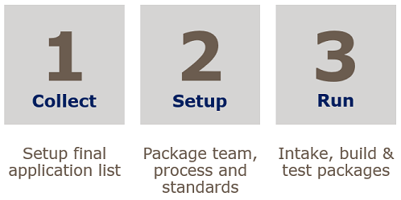
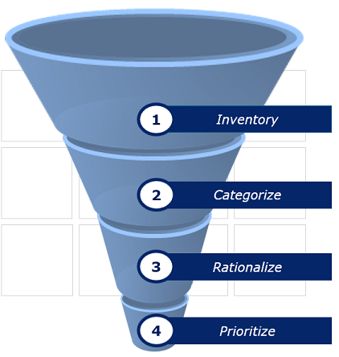
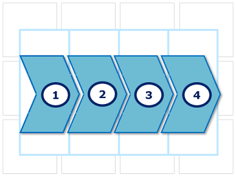

# Onboard Application Packaging

## Introduction

The Sogeti Smart Workspace is deployed with standard applications, usually part of the following set:

* Applications that are part of the Operating System, such as the Edge browser, Notepad, File Explorer and the OneDrive synchronization client.
* Applications part of the Office 365 suite, such as Outlook, Word, Excel, PowerPoint and Teams.
* Generic applications, such as 7Zip and Adobe Acrobat Reader.
* Management software and agents, such as the Nexthink collector package and Liquit agent.

Next to these generic applications, organizations make use of applications specific for their organization or business, called Line of Business applications (LOB or LOB-apps).  

To make sure all applications are available on time and deployed automatically and without errors. applications are repackaged to an automatically deployable format, such as unattended setups, App-V, MSIX or MSI packages. Regardless the underlying technology, the activities to create such deployable applications are generically called *packaging*. This chapter describes the standard approach for packaging and the aim and result for each of the different steps in the process.

Alongside so called *win32 apps*, we distinguish the following other types of applications:

* Applications from the *Windows Store*. Users can install these applications by themselves as Store Apps do not require administrator permissions. Optionally, applications are configured in the Microsoft Store for Business by the organization to whitelist applications. Users only can install applications approved apps from the Store for Business, the consumer store is not available for them.
* *Web- or SaaS apps*. These apps generically do not need additional configuration and run directly from a (modern) browser, that is included in the workspace.

These applications will not be packaged but to make sure the applications are offered and work according to business and user requirements, an intake for these applications is always done.

A well implemented process is key-factor for the success of application deployment in the Sogeti Smart Workspace. Therefore, proper alignment between business and IT and between Sogeti and the customer must be in place during implementation of the process. To help in discussion and explanation to the customer, the following design guide might be helpful. Download a copy in Dutch .pptx) or English .pptx).

## Onboarding packaging

For onboarding, we distinguish between two different, but related activities:

* Onboarding Sogeti Smart Workspace. In this phase, we speak of the SSW service as a whole.
* Onboarding packaging. In this phase, we speak of setting up the packaging process for a specific customer.

For onboarding the SSW service, all required applications need to be configured for deployment and potentially repackaged to suit requirements and standards. During this phase, the standard packaging process is followed for each application. Activities during onboarding of SSW differ from Run only in volume.

### Onboarding steps

The following figure shows the high-level phasing for the implementation and startup for the packaging activities. This phasing is used for activities during onboarding the Sogeti Smart Workspace. The first step is a crucial one to take as it determines the scope and workload during onboarding.

#### Collect

In this phase, the final list of applications is determined. This step is important because the list is required to be used in activity planning and to make sure applications are ready for use on time during SSW implementation. The workspace implementation is normally phased - by department or groups of users - the list is used so the packaging process can connect accordingly. The Collect phase is executed by the customer, or the customer is at least in the lead and Sogeti can support.

##### Determine Application list

Setting up the application list is determining which applications are required within the Smart Workspace service and by whom the applications are being used (group, department, division, etc.). Generally, this list is not yet available and setting up a proper, accurate list is not an easy task. To start filling the list, the following sources can be useful but success depends on if they are present, current and available:

* Configuration Management Database (CMDB).
* An application list or inventory from the current management tooling, such as Endpoint Manager or SCCM.
* A new inventory of the installed applications in the current workspace environment using scan tooling or software asset management tooling.

Usually, the inventoried list of applications is not yet accurate and contains pollution, in the form of applications that are no longer being used, apps found in different versions or apps installed by end-users themselves and are not managed, etc. Therefore, the list needs cleaning as shown in the following figure:
{: .center}

This four step process should result in a clean list of applications, at least accurate enough to start with. Some open ends may be picked up during the project when inventory of applications continues in parallel with the other activities.

1. Inventory.
In this step, applications are inventoried. The exact activities depend on the organization. Maybe a list is already present, for example setup before the transition to the new workspace, or an up-to-date CMDB. Is no such list available, it needs to be setup. Technical inventory can be done using the (existing) workspace management tooling or Software Asset Management tooling (SAM, such as Snow). For the packaging process, it is important the list contains detailed meta-data for the applications, such as owner, functional- and technical manager, key-user, etc. These roles are required later on, during rationalization and categorization and during packaging of the applications (intake and test).
2. Categorize.
Organizing the application list in different categories, helps the application list to be manageable, simplifies application assignment and helps cleaning up further in the process. Examples of categories are:
    * Categorization based on target group, such as base software, function or role specific or used for a specific business process.
    * Categorization based on application type, such as standalone, client/server, web app, shortcut, etc.
    * Categorization based on integration with other applications, such as plugins, or apps that combine into a suite of applications, such as AutoCAD or Adobe Cloud.
    * Categorization based on functionality, for example core office apps, development tool, financial application, etc.  
3. Rationalize.
Rationalization of the application list aims at removing doubles (including multiple versions of the same app and apps with similar functionality), unused applications and unwanted applications from the total list. To achieve this, the following requirements must be met:
    * the project must have mandate and consensus to make decisions in removal of apps.
    * the project members must have proper knowledge of the application portfolio, application functionality and/or usage and the business processes the apps support.
4. Prioritize.
When the application list is (nearly) complete, prioritizing the applications determines when the packages for the applications should be available and in which order packages should be build. This makes sure packages are available when required for deployment according to the deployment schedule. The other way around - the application list, combined with packaging progress, can be used to determine which users, groups or departments can be schedules for roll out.

#### Setup

In this phase, the packaging process is setup and implemented for the customer and focusses on making mutual agreements. Starting point is the standard Sogeti packaging process, added with the following activities:  
{: .center}

1. Define project resourcing.
Based on the application list, the required resources are estimated. This not only involves resources for building the packages but also concerns business users for delivering information, application software- and media and capacity to test and accept the applications after packaging is complete.
2. Finalize packaging standards and guidelines.
This is more a formal, but still an important step in the process. Sogeti will bring in the packaging guidelines for Sogeti Smart Workspace, which should be known to everyone involved in the application deployment process. Depending on the project scope, the scope of packaging guidelines might be changed. For example, if packaging for a remote workspace is required.
3. Agree on planning.
Based on the project plan for role out and the application list, detailed planning for the packaging activities is established. Generally, this is a mutual agreement between Sogeti and client project management.
4. Setup process agreements.
This step is all about process agreements for the following subjects:

    * Addition and removal of applications to and from the list.
    * (Re-)planning of applications and priorities on the list.
    * The way software and documentation is delivered, including technical implementation (for example an ftp server, specific folder on a file share, etc).
    * Procedure for planning and invitation for intake, test and acceptance.
    * Involvement of application owners, managers and/or key-users.
    * Involvement of intake, package and test engineers, including on- and off-boarding.
    * Escalation procedure to solve generic issues and issues related to the workspace solution and its architecture.

It is advisable to acknowledge and communicate procedures and agreements with all stake holders, for example in a kick-off meeting. This meeting should also address the packaging process, discussed in the following paragraph, to establish good understanding, awareness and clear expectations. This helps in a smooth packaging process later on during the project.

#### Run

When all prerequisites have been met - the application list is (almost) complete, agreements have been made and the packaging team is installed, including stakeholders from the business - the packaging activities can be started. The process is described in detail [here](../process/index.md). Below you can find a summary of the steps in the process and where the responsibility lies. Every package will go through the steps mentioned:

steps 1 (request) and 6 (deployment): these steps have a Business/client focus. The client determines which application is required and appoints users who need the particular application.

steps 2 (intake) and 5 (acceptance): these steps have a joined focus. The intake and acceptance test will be carried out together. The client delivers information, Sogeti will execute or facilitate in these steps.

steps 3 (build) and 4 (test): these steps have a Sogeti focus. The activities in these steps will be managed and executed under Sogeti's responsibility and by Sogeti.
