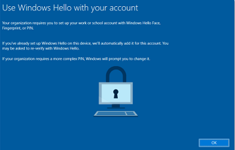
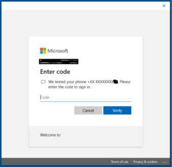
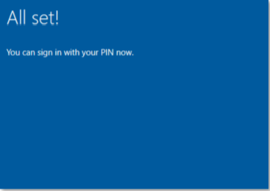

# Hello for Business

The default configuration for Windows in Sogeti Smart Workspace makes use of Hello for Business (HfB). HfB replaces passwords by using strong two factor authentication, based on PIN or biometric gestures, such as fingerprint or facial recognition. A new credential is created on the *device* which ties the HfB credential to the specific device on which the credential is created. During configuration of HfB on the device by the user, a trusted relation between the device and Azure Active Directory is setup so the device can be used, next to the PIN or biometric gesture, as a second factor of authentication.

The most important aspects for HfB are:

* Replaces the user password. During device login, the user credentials, including password, are no longer sent and checked with the identity provider (Azure Active Directory) for verification and authentication so the credentials cannot be intercepted. Instead, an asymmetric key pair is used that is created when the user configures HfB, which is used for encryption of the authentication request.
* The PIN code is tied to the device, without the device the PIN code is useless to login with. Should a third party intercept the PIN code, the specific device is required to use the PIN. This is not the case when passwords are being used, which can be used on other devices. Using biometric gestures mitigates this risk of stolen credentials even further.
* The PIN code is safely stored in the TPM chip on the device.
* By using HfB to login on an Azure AD joined device, users have Single Sign On (SSO) experience to apps that use Azure Active Directory as their identity provider, such as Office 365.

## Configuration

To configure Hello for Business, an *identity Protection* profile is created in Endpoint Manager (Intune) and assigned to SSW users. Setting up HfB, by configuring at least a PIN code, is forced in first login after the policy is applied.

The following table shows the most important configuration settings and the proposed values in Sogeti Smart Workspace:

|Configuration|Proposed value|
|-------------|--------------|
|Enable HfB|Enabled|
|Minimum PIN length|6 characters|
|Lowercase letters in PIN|Allowed
||Alternative: *Not Allowed* or *Required*|
|Uppercase letters in PIN|Allowed|
||Alternative: *Not Allowed* or *Required*|
|Special characters in PIN|Allowed|
||Alternative: *Not Allowed* or *Required*|
|PIN expiration (days)|Not configured|
||Alternative: Never or *x* number of days (1-730)|
|PIN history|Not Configured|
||Alternative: No or *x* number of revisions (1-50)|
|Enable PIN Recovery|Enabled|
|Use of TPM chip|Enabled|
||Alternative: Not configured. TPM is preferred but not used on devices that do not have a TPM|
|Use of biometric gesture|Allowed|
|Use enhanced anti-spoofing, when available|Enabled|

The following two settings are important when HfB is also configured for on-premise resources, in a hybrid configuration:

|Configuration|Proposed value|
|-------------|--------------|
|Certificate for on-premise resources|Not Configured|
|Use security keys for sign-in|Not Configured}

The SSW default is to configure HfB in a cloud only configuration.

## End-user experience

At the end stage of the Autopilot device enrollment in Sogeti Smart Workspace, at first login, the user is forced to setup HfB by specification of a PIN code:
{: .center}

On clicking *Ok* the user receives an MFA challenge:
{: .center}

The user must configure a PIN code:
{: .center}

Configuration of HfB is complete. The user can use the PIN code instead of the password to login into the device. Optionally, the user can configure to use a biometric gesture when this is supported by the device hardware.
{: .center}

When users login with a PIN code, these credentials will also be used when other, on-premise resources are connected such as file shares and printers. The default setup for HfB is a cloud implementation. Because HfB is not configured for on-premise (AD connected) resources, authentication to these workloads will fail. When a login screen is presented, users can change the authentication to use the password instead of the PIN code and then connection will succeed. Solutions to mitigate this behavior are:

* Implementation of Hybrid HfB, using certificates or security keys.
* Use the application portal to connect to printers and file shares. In the App Portal's package configuration, the use of on-premise credentials is configured. users are asked to fill in their credentials on first use which are then stored in the app portal's credential vault. These credentials are subsequently used to setup the connection.

### Behavior when wrong credentials (PIN, biometric gesture or password) is used

To protect against unauthorized access, the following measures are configured:

* Setting up a PIN code is mandatory, even when a biometric gesture is configured later on. The PIN can be used to fallback on, when the biometric gesture does not work.
* Next to using HfB to login, users still can use username and password. While users are advised not to use the password, the password can be used as fallback when HfB does not work. It is also possible to block the use of passwords through an Intune policy. This is not configured by default and must be negotiated with the customer.
* Using the option *‘I forgot my PIN’* in the login screen, users can restore a forgotten PIN code. Users need to re-authenticate to Azure Active Directory and when that is successful, a new PIN code can be configured.
* By default policies, repeated use of invalid HfB or password credentials is protected. When user's repeatedly use the wrong password or PIN, the user is warned that wrong credentials are used to many times and that the device will restart when the next attempt is again not valid. The device will then be forced to restart in Bitlocker recovery mode. The Bitlocker recovery key, which is stored in Azure Active Directory and can be retrieved by Support, is required to unlock the device. The default setting is to lock the device after 4 failed attempts but this can be changed through an Intune policy between 4 and 16 times.

## Additional configuration

Optionally, the following additional features can be configured in combination with HfB:

* Multi factor Unlock
* Dynamic Lock

To enable these features, depending on the used configuration it might be required that users connect their phone to the Windows device using Bluetooth. Because this is not achievable in all organizations, these features are not enabled by default. However, Sogeti recommends to consider and use these features whenever possible.

### Multi factor Unlock

Using this feature, next to the PIN code or biometric gesture, a second factor is required at device login. This can be one of the following options:

* PIN, but only when a PIN code is not already used for login.
* Trusted signal.

A trusted signal is delivered by one of the following sources:

* Network (‘IPConfig’). With this option, the IP-address, Gateway, DHCP server and/or DNS server is used to verify the connection with the device. When verified, this is used as a valid factor. IPConfig can be used with IPv4 and IPv6 addresses.
* Bluetooth. With this option, in sight presence of a Bluetooth connected device is required to use as the second factor for device login. Most likely, this is the user's mobile phone. Before the feature can be used, the user must configure a bluetooth connection between the Windows device and the phone. When the device is out of range, login to the device with HfB will not succeed.
* WiFi: Using the Wi-Fi signal, the (‘corporate’) Wireless network can be configured as a second factor. This means, login is enabled when the device is connected with the configured wireless network. A network can be configured based on the following characteristics:

* SSID (mandatory)
* SSID, the access point's mac-address (optional)
* Security, the type of security and encryption configuration that is used on the Wi-Fi connection, one of the following:
    1. Open
    2. WEP
    3. WPA Personal
    4. WPA Enterprise
    5. WPA2 Personal
    6. WPA2 Enterprise
* TrustedRootCA, thumbprint of the root certificate that is used for the Wi-Fi connection (optional)
* Sig_quality, The connection's minimum signal quality (0-100) in order to mark as trusted (mandatory).

#### User Experience

Normally, enabling Multi factor unlock will not impact user experience, provided the user has connected a phone and the phone is within range of the device. It might take a very small moment before the phone's signal is picked up but the login flow is similar to not using Multi factor unlock. However, without a proper signal from the connected device, users are unable to login.

Once logged in, the connected device (phone) is no longer used for Multi Factor Unlock. Except when the user logs off and wants to re-login into the device, presence of the connected device is again required.

#### Configuration in Sogeti Smart Workspace

The configuration for Multi Factor unlock requires organization specific configuration, using an Intune configuration profile.

The Sogeti Smart workspace solution aims at enabling the use independent of location and time. Configuring Multi Factor Unlock based on the companies Wi-Fi profile makes this hard to achieve. Therefore, the use of a connected phone through Bluetooth is the default option.

### Dynamic Lock

Dynamic lock is a Windows feature with which the device is automatically locked when a signal of a connected device is out of range. For example when the user leaves the workplace and takes along the connected phone.

Dynamic Lock is configured using a custom Intune profile. After enabling (and forcing) the feature, the user needs to connect a phone to the device. After the connection is established, Dynamic Lock is active. The device will automatically lock when the Bluetooth signal from the phone is out of range.
