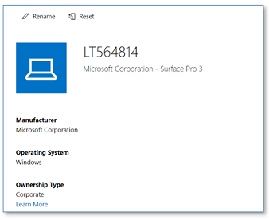

# Windows Device Reset

During the lifecycle of Windows devices, users may run into issues where the operating system or application(s) do not function as expected. Or the device is handed over to another user who wants to start with a freshly installed device. In these circumstances, a reset of Windows 10 might be the only, or a time saving solution. Out of the box, Windows 10 offers the ability to reset the PC to a fresh state, optionally keeping personal files. This option can be chosen from the Windows 10 Recovery menu in the Settings App. However, users need administrator permissions to reset their device and off course, the ability to login to the device is required. In Smart Workspace, where devices are managed with Endpoint Manager (Intune), additional options are available to reset a device. A reset can be triggered by IT admins but also users can initiate a device reset. This option offers self-service and, after proper instructions beforehand, can save service desk calls and make users more productive.

## Managed Reset

Windows 10 devices in Smart Workspace are managed with Microsoft Endpoint Manager / Intune and enrolled using the Autopilot process. Upon onboarding a device, the device is Azure Active Directory joined and enrolled in Intune. From the Intune management console, the following options are available for administrators :

### Wipe the device

This option will remove the device from Intune management and triggers a device reset. Windows 10 is re-installed, removing all data and applications from the device. This option typically is used when a device is lost or stolen, or when the device is otherwise no longer in use, but it can also be used when a device has issues or is to be handed over to a different user.

Additionally, the following options can be chosen by the administrator before the wipe is launched:

* Wipe the device but keep enrollment state and associated user account
* Wipe the device and continue, even when the device loses power
The first option can be used to reset a device which is used by the same user after the reset is complete, keeping the user data untouched. The second option should only (still optional) be chosen when the device is lost or stolen.

When the wipe is complete, the device will launch in the ‘Out of The Box Experience’ (OOBE) state, where the user can re-enroll the device into management using the Autopilot process.

### Fresh Start

The fresh start option will remove the device from Intune management and initiate a reset (reinstallation) of Windows 10. After selecting this option, the administrator can choose to retain user data on the device.
When the reset is complete, the device will launch in the ‘Out of The Box Experience’ state, where the user can re-enroll the device into management using the Autopilot process.

The fresh restart looks similar to the Wipe action. Key difference is that using this option will also remove any OEM pre-loaded applications, such as Dell Command Update on Dell computers. If you want to get rid of bloat ware, use this option.

### Autopilot Reset

Initiating an Autopilot Reset will re-install Windows 10 on the device. However, this option maintains the Intune Enrollment state in Azure AD and Intune. Autopilot Reset also maintains the region, language and keyboard settings and the configured Wi-Fi connection. As the enrollment state is preserved but the user data is removed, this is a good option when a device needs to be handed over to another user in the organization.

There are some caveats in this option. First of all, the device is not going through the OOBE (and Autopilot) process but directly boots into Windows – using the preserved settings. When the Enrollment Status Page (ESP) is not enabled, users can directly login to Windows. When the ESP is enabled, users might see less policies and apps to be applied. Once complete, some settings and / or apps might not yet be configured or installed. The experienced behavior depends on the ESP configuration for blocking the device use before all or a selection of apps is installed. Remaining apps and settings will come through after the device (re-)synchronizes with Intune but for end users, it might look configuration has failed. The synchronization can be forced from the Intune management portal.

Notes for Self-deployment and Pre-provisioning
For devices that are enrolled using one of the Autopilot ‘Self-Deploying’ or ‘Pre-Provisioning’  modes, it is necessary the device is removed from Intune prior to (re-)enrolling the device, otherwise enrollment will fail. That means that the Autopilot Reset option cannot be used in these cases. Typically, the device is removed from Intune automatically when ‘Wipe’ or “Fresh Start’ is used. Some organizations use an USB drive with the Windows 10 installation media to re-enroll devices. This approach can still be used but the device needs to be removed from the Intune portal prior to reinstallation of the operating system.

### Conclusion

There are different options in Intune to reset a device. Depending on the goal and purpose, one option may prefer over the other. In all cases, a good understanding of the key differences between options is required. These are mentioned in the following table.

|Option|Device is removed from Intune|Retain user data|Retain enrollment state|Retain OEM preloaded apps|Launch in OOBE after reset|
|------|-----------------------------|----------------|-----------------------|-------------------------|--------------------------|
|Wipe|Yes|Optional|Optional|Yes|Yes|
|Fresh Start|Yes|Optional|No|No|Yes|
|Installation Media|No|No|No|No|Yes|

* To reset a device, followed by a new Autopilot enrollment, choose Wipe
* To start with a fresh Windows 10 installation, removing OEM pre-installed apps, choose Fresh Start
* To quickly reset a device that will be re-used by the same or another user, select Autopilot Reset. However, this option cannot be used for self-deploying or pre-provisioning profiles.
* When a device is lost or stolen, select Wipe with the option to continue even when power is lost.

Since there is no user data on the device in Smart Workspace (this is stored in OneDrive for Business, Teams or SharePoint), we typically do not choose to retain user data upon device resets.

The preferred option in all cases is to use ‘Wipe’, without retaining the enrollment state.

## User initiated reset (self-service)

A user can also reset a device from the Intune Company Portal when the device is associated with this same user. This typically is the case for personal used (but company owned) devices such as laptops and is not the case for shared devices, such as desktop computers - devices that are enrolled using the Autopilot Self-Deploying profile. Users also cannot reset a device when it is assigned to a different user.

If the Company portal app is installed on the device, the user can launch it, select the device from all devices that are registered to this user and choose to reset the device. The device then will be wiped, where all apps and user data are removed, and Windows 10 is reinstalled. The device will boot in the OOBE state when the wipe is complete. The user then can re-enroll the device using the Autopilot service.

If the company portal app is not installed, users can use the [Company Portal Website](https://portal.manage.microsoft.com/){target=_blank}. In the devices area, users can see all devices registered to them and select the device of interest. In the menu, users select the option to reset the device:

{: .center}

## Local Reset

For managed and user-initiated resets, it is required that an internet connection is available, and the device still synchronizes with Intune. After all, the reset command is initiated from the Intune management or company portal and needs to be send to and picked up by the device. When the device no longer synchronizes with Intune, the following options are available to reset the device. Note that for ‘Self-Deploying’ or ‘Pre-Provisioning’ profiles, the device must be removed manually.

### Reset from the Settings App in Windows 10

Login to the device with an administrator account and in the settings apps, select Update and Security, Recovery and then Reset this PC. Optionally, select Keep my files to retain user data. This option is comparable with the Wipe action.

### Reset from the login screen

When Windows boots and launches but you no longer can login into Windows, you can initiate the reset from the login screen. To do so, keep the Shift key pressed and restart Windows from the login screen. This will boot into recovery mode from where you can reset Windows. Note that you need the Bitlocker recovery key to continue. Normally, this key is stored in Azure Active Directory.

### Autopilot reset from login screen

When enabled, an additional option is available in the sign-in options which initiates an Autopilot reset. The reset can also be initiated with the keystrokes CTRL + Windows key + R on the login screen. An administrator account is required to login, the behavior is similar to an Autopilot Reset initiated from the Intune management portal. Note that Intune Synchronization is still required for this option.

## Retire and delete devices

The Intune management portal also has the options to Delete or Retire a device. When chosen, the device is removed from management and managed apps and data are removed from the device. Note that this may cause the device becoming unusable, as you no longer can log in with an Azure AD account. Since the Bitlocker recovery key is also stored in Azure AD and may be removed when a device is removed – you no longer can use the device recovery to reset the device. Reinstallation from Windows 10 media would then be the only option.

* The Delete option is only to be used when the device is no longer in use in the organization. However, when a reset is initiated from the device because it no longer syncs with Intune, a delete can be initiated directly when the reset is initiated on the device. This will make sure the device is properly re-enrolled into management. Do not remove the device from Azure AD.
* The Retire option is meant for BYOD devices only, that are typically not Azure AD joined but enrolled into Intune management only and need to be removed from management, without resetting Windows 10.

## Appendix: Device registrations in Azure AD and Intune

For successful usage of Intune and Autopilot during the lifecycle for a device, it is important to understand the different device registrations in the management environment. The end-result in all cases is to use Autopilot deployed devices which are Azure AD joined and Intune enrolled. To achieve this result, the following actions must be done, and in this order.

We’ll start with a new device, that is not used before.

1. Register the device in Autopilot. To register the device, a csv-file with the device specific hash-id, is imported in Endpoint Manager. The hash-id can be seen as a device signature where the Autopilot service links the device to a specific organization. The import of hash files is done by Sogeti engineers and results in the following registrations:

    * A device record in Autopilot, using the device serial number. A group tag is read from the CSV file to specify the device role in the environment (laptop, shared device, kiosk device, etc.). Azure AD dynamic groups contain devices based on these group tags, the groups are used to assign profiles, policies, and apps in Intune.
    * A device registration in Azure AD. This registration contains two important attributes: the device is an autopilot device and the group tag. Both are used in Azure AD dynamic groups, if this registration is corrupted then the groups might not be populated correctly. Therefore, removing the registration from Azure AD is blocked if the device is also registered as an Autopilot device. On first creation of this record, the device state is disabled and will be enabled once the device is enrolled.

2. Enroll the device with the Autopilot enrollment process. During this process, the device is Azure AD joined, on which the device record in Azure AD is updated with device specific information. This device record is also set to Enabled. Secondly, the device is enrolled in Intune. Upon enrollment, the device is registered with a record in Intune.

In normal operation, the Autopilot registration and Azure AD device registration do not require changes or updates by an admin. The only change that can be required, is changing the Group Tag in the Autopilot registration, for example when the device role is changed or when the current Group Tag is incorrect. The registration in Intune can require the following updates:

1. When a device is reset (using the wipe or fresh start procedures described in the previous paragraphs), the device is automatically removed from Intune. Upon re-enrollment, the device is again added to Intune with a new record.
2. In some cases, for example when the device is reset using manual intervention, the device record also needs to be removed manually. This can be achieved using the Delete option in the [Intune management portal](https://endpoint.microsoft.com/#blade/Microsoft_Intune_DeviceSettings/DevicesWindowsMenu/windowsDevices){target=_blank}.

Resume:

* In the Autopilot device enrollment process, the device is registered in Autopilot, Azure AD, and Intune.
* Only the Intune record is created, updated or deleted during the device lifecycle and (re-)enrollments.
* Do not remove or change the device records in Autopilot or Azure AD as this can lead to unexpected results. When the registration is out of order, follow these steps (typically carried out by a Sogeti engineer):

    1. Remove (delete) the device from Intune
    2. Delete the device from Autopilot
    3. Delete the record for the device in Azure AD
    4. Re-import the device using the csv file with the device specific hash
    5. Enroll the device as it where a new device

Wait 10-15 minutes after removing the device from Azure AD and importing the device in Autopilot in order to allow the Autopilot service properly sync the changes.
